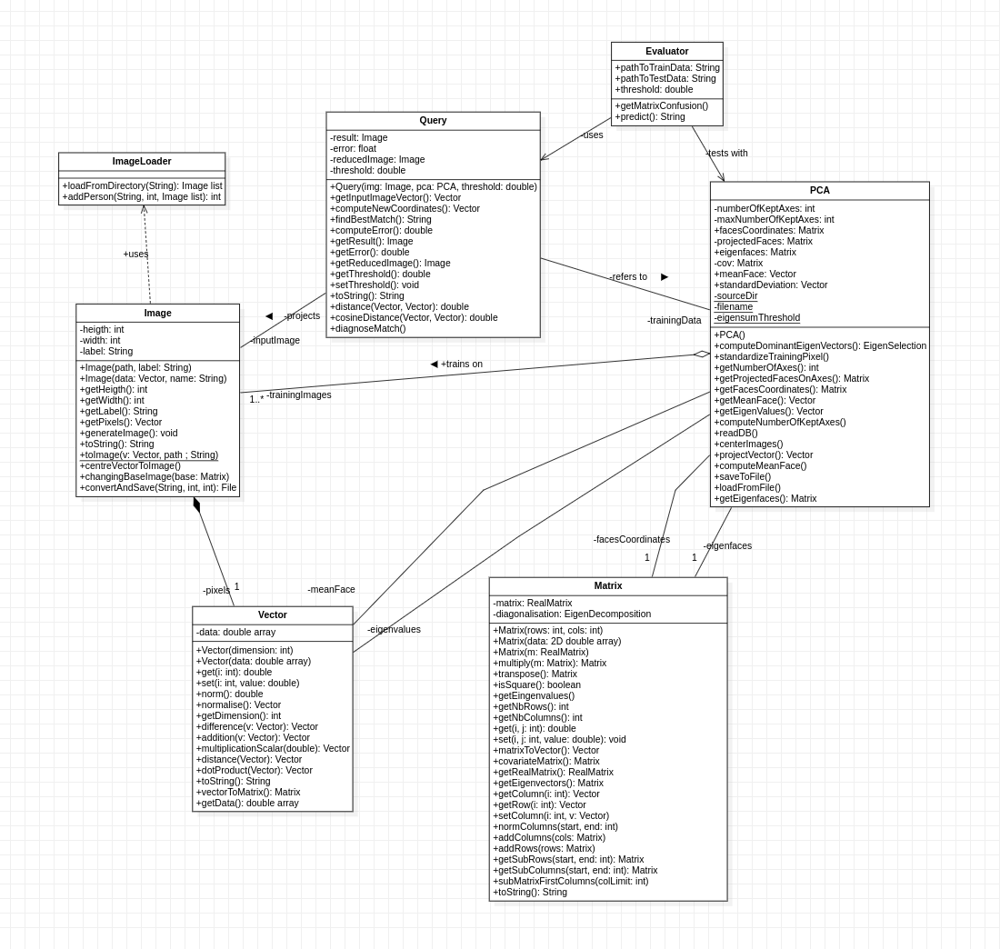

# Reconnaissance faciale par ACP

Application Java de reconnaissance faciale fondée sur l'Analyse en Composantes
Principales (ACP) et la méthode des eigenfaces.

Le projet transforme des images de visages en vecteurs, construit un espace de
représentation de dimension réduite, puis recherche l'identité la plus proche à
l'aide d'une distance cosinus. Un seuil propre à chaque individu permet aussi de
rejeter une image lorsque personne dans la base ne lui ressemble suffisamment.

Ce projet a été réalisé dans un cadre académique à CY Tech.

## Résultats clés

Évaluation réalisée avec 30 individus connus, soit 90 images connues, et 27 images
appartenant à des individus absents de la base d'entraînement.

| Métrique | Résultat |
| --- | ---: |
| Précision des prédictions connues | **98,67 %** |
| F1-score | **89,70 %** |
| Taux de discrimination | **94,44 %** |
| Exactitude en contexte ouvert | **85,47 %** |
| Exactitude sur les individus connus | **82,22 %** |

Points notables :

- **aucune mauvaise identité attribuée** parmi les individus connus ;
- **26 inconnus correctement rejetés sur 27** ;
- une seule image inconnue acceptée à tort ;
- 74 images connues correctement reconnues sur 90 ;
- 16 images connues rejetées, ce qui constitue la principale source d'erreur.

Ces résultats montrent que le modèle est très fiable lorsqu'il accepte une
identité. Son principal axe d'amélioration concerne le rappel : certains visages
connus sont encore rejetés par leur seuil personnalisé.

## Fonctionnalités

- chargement d'une base d'images organisée par identité ;
- conversion des images en vecteurs de pixels ;
- standardisation à partir des statistiques du jeu d'entraînement ;
- calcul du visage moyen et des eigenfaces ;
- réduction de dimension par ACP ;
- sélection d'axes visant 85 % de l'inertie, dans la limite de 100 axes calculés ;
- exclusion des trois premiers axes lors de la reconnaissance ;
- recherche du plus proche voisin avec la distance cosinus ;
- seuil d'acceptation personnalisé pour chaque individu ;
- rejet des personnes inconnues ;
- interface graphique JavaFX ;
- affichage du visage moyen, des eigenfaces et de la variance cumulée ;
- réglage du nombre d'axes utilisés depuis l'interface ;
- programme d'évaluation en contexte fermé et ouvert.

## Principe

### 1. Préparation des images

Les images du jeu fourni sont en niveaux de gris et mesurent 64 x 64 pixels. Une
image est donc représentée par un vecteur de 4096 valeurs.

Les moyennes et écarts-types de chaque pixel sont calculés uniquement à partir du
jeu d'entraînement. Ces statistiques servent ensuite à standardiser aussi bien
les images d'entraînement que les images recherchées.

### 2. Analyse en composantes principales

Après standardisation, les visages sont centrés autour du visage moyen. Le
programme calcule ensuite la matrice de covariance et recherche ses vecteurs
propres dominants par itérations de puissance.

Les vecteurs propres sont transformés en eigenfaces. Chaque visage peut alors être
projeté dans un espace de dimension réduite au lieu d'être comparé directement
sur ses 4096 pixels.

Le programme calcule au maximum 100 axes et s'arrête plus tôt si l'énergie cumulée
atteint 85 %. Les trois premiers axes sont ignorés pendant la reconnaissance afin
de réduire l'influence des variations globales dominantes.

### 3. Recherche d'une identité

La comparaison utilise la distance cosinus :

```text
distance(a, b) = 1 - cos(a, b)
```

Pour chaque individu, la distance retenue est la plus petite distance entre
l'image recherchée et ses images d'entraînement projetées.

Un seuil personnalisé est calculé à partir des distances des images de l'individu
à leur centroïde :

```text
seuil = moyenne des distances + 2 x écart-type
```

Ce seuil est :

- limité par un plancher de `0,01` dans l'interface graphique ;
- limité par un plancher de `0,10` dans l'évaluateur ;
- plafonné à `0,30`.

Parmi les individus qui respectent leur propre seuil, le programme retourne celui
dont l'image d'entraînement est la plus proche. Si aucun seuil n'est respecté, le
résultat est une personne inconnue.

Le coefficient `2` augmente la tolérance en fonction de la dispersion des images
d'un individu. Il ne supprime pas les valeurs aberrantes. L'implémentation
actuelle n'utilise ni la règle de Tukey, ni les quartiles, ni l'IQR.

Une description mathématique plus détaillée est disponible dans
[`maths/src/abstraction/recherche.md`](maths/src/abstraction/recherche.md).

## Interface graphique

L'interface JavaFX permet de :

1. charger la base d'entraînement ;
2. sélectionner une image JPEG ou PNG ;
3. lancer une recherche ;
4. afficher l'identité reconnue ou le rejet « Personne inconnue » ;
5. visualiser le visage moyen et jusqu'à 20 eigenfaces ;
6. modifier le nombre d'axes utilisés pour la projection ;
7. recharger la base depuis le menu.

L'initialisation de l'ACP est effectuée dans un thread séparé. Le premier lancement
peut prendre du temps, car les eigenfaces sont calculées à partir de toutes les
images d'entraînement.

## Jeu de données

Le projet utilise le jeu AT&T/Olivetti Faces. Le jeu d'origine contient 400 images
de 40 personnes, avec 10 images de 64 x 64 pixels par personne.

Le découpage prévu par [`data_filtred3/manifest.txt`](data_filtred3/manifest.txt)
est le suivant :

| Ensemble | Images par personne |
| --- | ---: |
| Entraînement | 7 |
| Test | 3 |

Dans l'état actuel des dossiers, l'identité `7` est absente. Les données réellement
présentes sont donc :

| Ensemble | Individus présents | Images par individu | Total |
| --- | ---: | ---: | ---: |
| `data_filtred3/train` | 39 | 7 | 273 |
| `data_filtred3/test` | 39 | 3 | 117 |

Les identifiants présents vont de `0` à `39`, à l'exception de `7`.

L'organisation attendue est :

```text
data_filtred3/
├── manifest.txt
├── train/
│   ├── 0/
│   │   ├── img_01.jpg
│   │   └── ...
│   └── ...
└── test/
    ├── 0/
    │   ├── img_01.jpg
    │   └── ...
    └── ...
```

### Crédit du jeu de données

Jeu de données : AT&T Laboratories Cambridge, “The Database of Faces” / Olivetti Faces, utilisé via scikit-learn fetch_olivetti_faces. Crédit : AT&T Laboratories Cambridge.

## Prérequis

- Java 21 ;
- un environnement graphique pour utiliser l'interface JavaFX ;

Vérification :

```bash
java --version
```

Préparation :
1. Télécharger les fichiers du dépôt GitHub (avec une clonage ou via une archive .zip).
2. Si besoin, télécharger JavaFX via le lien suivant https://gluonhq.com/products/javafx/.
La librairie n'a pas été incluse sur le dépôt GitHub pour éviter le téléchargement de la librairie si celui-ci n'est pas nécessaire.
3. Copier le dossier openjfx-**.*.**_linux-x64_bin-sdk/javafx-sdk-**.*.**/lib de l'archive JavaFX dans le répertoire [`data_acp_project_2026/maths`](data_acp_project_2026/maths)


## Compilation
Déplacez-vous dans le répertoire [`data_acp_project_2026/maths`](data_acp_project_2026/maths) puis lancer la commande suivante :
```bash
ant run
```
La compilation devrait se lancer et prendre quelques seconde. L'application se lancera juste après.


A titre informatif, la classe de lancement est `app.IHM`.

### Évaluation

Après compilation :

```bash
java -cp maths/target/classes abstraction.Evaluator
```

L'évaluateur actuel :

- entraîne l'ACP sur les 30 premières identités disponibles ;
- évalue trois images par identité connue ;
- ajoute jusqu'à 10 identités inconnues ;
- utilise un seuil minimal de `0,10` ;
- affiche les erreurs de classification et les métriques finales.

Les principales métriques sont :

| Métrique | Signification |
| --- | --- |
| `accuracy` | proportion d'images connues correctement reconnues |
| `discriminationRate` | capacité du plus proche voisin à retrouver la bonne identité sans appliquer le rejet |
| `openSetAccuracy` | proportion globale de personnes connues reconnues et d'inconnus correctement rejetés |
| `knownRejected` | personnes connues rejetées à tort |
| `knownMisclassified` | personnes connues associées à une mauvaise identité |
| `unknownAccepted` | personnes inconnues acceptées à tort |
| `unknownRejected` | personnes inconnues correctement rejetées |
| `precision` | proportion de prédictions connues qui correspondent à la bonne identité |
| `recall` | proportion d'images connues correctement reconnues |
| `f1Score` | moyenne harmonique entre la précision et le rappel |

Pour ces trois dernières métriques, la reconnaissance correcte d'une identité
connue est considérée comme la classe positive :

```text
precision = knownCorrect
            / (knownCorrect + knownMisclassified + unknownAccepted)

recall = knownCorrect / knownEvaluated

f1Score = 2 x precision x recall / (precision + recall)
```

Les résultats dépendent du contenu du dataset, du nombre d'axes calculés et des
seuils présents dans le code. Le README ne conserve donc pas de score fixe qui
pourrait devenir obsolète après une modification du modèle.

## Architecture

Le code applicatif se trouve dans le module `maths`.

| Élément | Rôle |
| --- | --- |
| `app.IHM` | interface graphique et lancement des recherches |
| `abstraction.Image` | lecture, conversion et vectorisation des images |
| `abstraction.ImageLoader` | chargement des dossiers organisés par identité |
| `abstraction.PCA` | standardisation, ACP, eigenfaces et projections |
| `abstraction.Query` | distance cosinus, seuils personnalisés et sélection du résultat |
| `abstraction.Evaluator` | évaluation des identités connues et inconnues |
| `math.Matrix` et `math.Vector` | structures utilisées pour les calculs |
| `math.*` | bibliothèque mathématique embarquée |
| `graph.*` | visualisations et essais graphiques historiques |

Le diagramme de classes est disponible ici :



## Structure du dépôt

```text
.
├── README.md
├── pom.xml
├── olivetti_faces.mat
├── data_filtred3/
│   ├── manifest.txt
│   ├── train/
│   └── test/
├── diagramme/
│   └── diagramme_classe.png
└── maths/
    ├── pom.xml
    ├── build.xml
    └── src/
        ├── abstraction/
        ├── app/
        ├── graph/
        ├── math/
        └── module-info.java
```

## Fichiers générés

Lorsqu'aucune sauvegarde ACP exploitable n'est trouvée, `PCA` recalcule le modèle.
Selon son mode d'appel, il peut produire :

```text
debug/
├── meanface.jpg
├── eigenfaces/
└── visages/
```

Le code contient également la prise en charge d'un fichier `.PCAsave`, mais
l'enregistrement automatique est actuellement désactivé. Un lancement normal peut
donc recalculer l'ACP.

## Limites connues

- le manifeste annonce 40 identités alors que l'identité `7` manque dans les
  dossiers actuels ;
- le seuil fondé sur la moyenne et l'écart-type est sensible aux valeurs
  aberrantes ;
- les trois premiers axes sont toujours ignorés ;
- le calcul de l'ACP est coûteux et la sauvegarde automatique du modèle est
  désactivée ;
- plusieurs tests sont des programmes Java manuels et non des tests JUnit ;
- la base mathématique embarquée rend la compilation plus longue ;
- les performances doivent être mesurées de nouveau après chaque modification des
  seuils ou du nombre d'axes.

## Pistes d'amélioration

- restaurer l'identité manquante ou corriger le manifeste ;
- filtrer les valeurs aberrantes avant le calcul des seuils ;
- valider les seuils sur un ensemble séparé ;
- sauvegarder et versionner le format du modèle ACP ;
- ajouter des tests unitaires et une matrice de confusion exploitable ;
- rendre le nombre d'axes ignorés configurable ;
- comparer l'ACP à une méthode supervisée ou à des embeddings modernes.

## Licence

Aucune licence logicielle n'est actuellement définie dans le dépôt. Avant toute
publication ou redistribution, il faut ajouter une licence au projet et respecter
les conditions d'utilisation du jeu de données.
